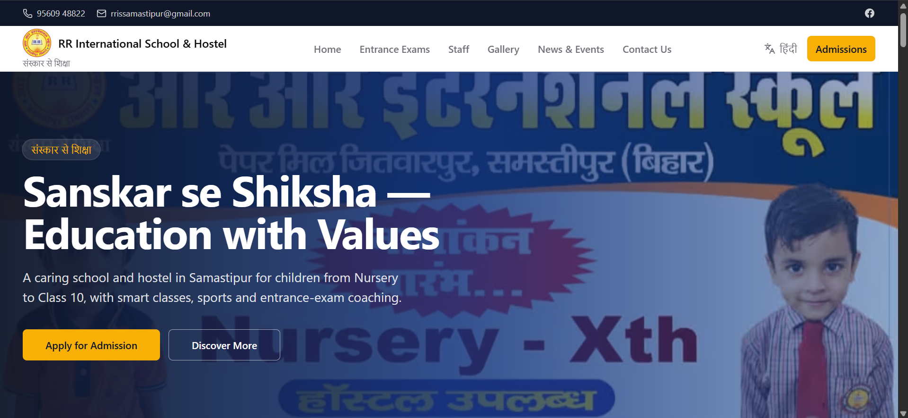
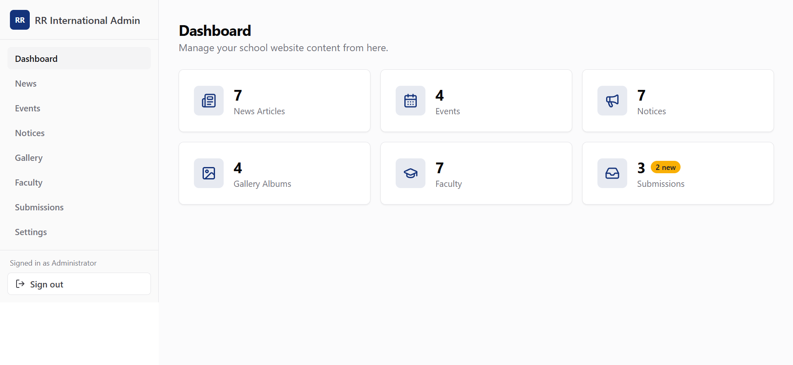
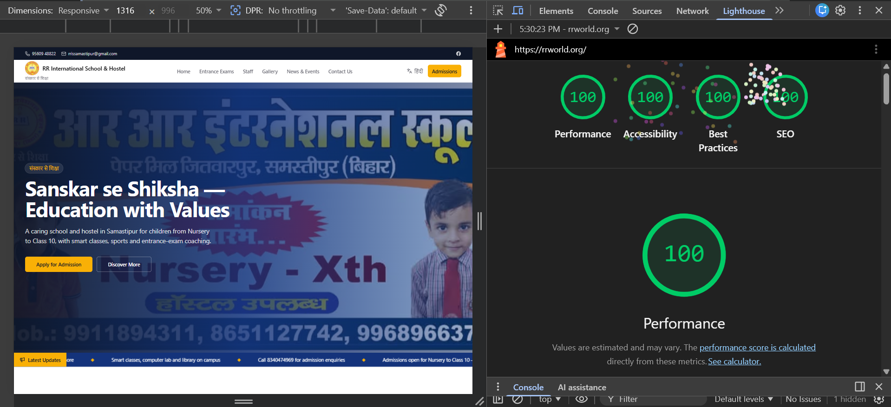
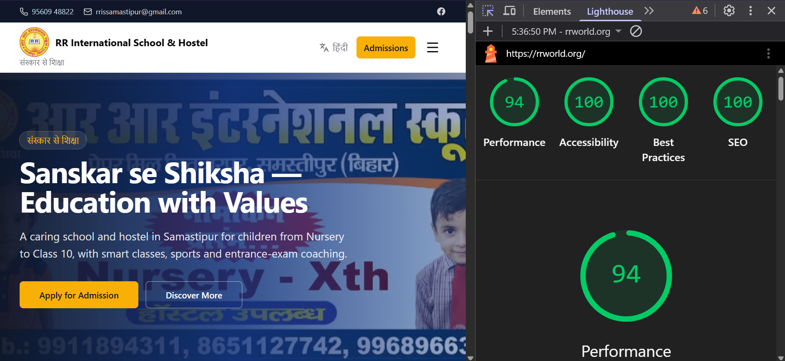

# RR International School & Hostel - Website and CMS Case Study

Live site: https://rrworld.org  
Role: Freelance Full-Stack Developer  
Repository: Private client source code, public case study only

## Overview

RR International School & Hostel needed a production website that school staff could update without depending on a developer for every notice, event, photo, or content change.

I built and deployed a bilingual school website with a self-service CMS, admin authentication, database-driven content, secure media uploads, SEO basics, analytics, custom domain setup, and handover documentation.

The final system is live at **rrworld.org** and supports day-to-day content updates through an admin dashboard.

## What I Built

- Public school website for admissions, entrance-exam coaching, staff, gallery, news, events, and contact pages
- Auth-gated admin dashboard for non-technical school staff
- CMS for news, events, notices, gallery albums, faculty profiles, site settings, founder message, and contact submissions
- Hindi and English localization with cookie-based language switching
- Secure image upload flow using signed Cloudinary uploads
- Contact enquiry flow with database persistence and optional email notification
- SEO and production launch setup: metadata, OpenGraph, sitemap, robots.txt, GA4, custom domain, and SSL
- Admin and deployment handover guides for long-term maintainability

## Tech Stack

| Area | Tools |
|---|---|
| Frontend | Next.js 14 App Router, React, TypeScript, Tailwind CSS, shadcn/ui |
| Backend | Next.js Route Handlers, REST-style CRUD APIs, Zod validation |
| Database | MongoDB Atlas, Mongoose |
| Auth | NextAuth credentials provider, bcrypt password hashing |
| Media | Cloudinary signed uploads |
| Deployment | Vercel, Cloudflare DNS, custom domain, SSL |
| SEO/Analytics | Sitemap, robots.txt, OpenGraph metadata, Google Analytics 4, Search Console |

## Results

| Metric | Result |
|---|---|
| Desktop Lighthouse | 100 Performance, 100 Accessibility, 100 Best Practices, 100 SEO |
| Mobile Lighthouse | 94 Performance, 100 Accessibility, 100 Best Practices, 100 SEO in the captured run |
| Content freshness | Admin edits go live in about 1 second without redeploys |
| CMS coverage | News, events, notices, gallery, faculty, settings, founder message, submissions |
| Deployment | Live production site with custom domain and SSL |

Note: the included mobile Lighthouse screenshot shows a 94 performance score. Lighthouse scores vary slightly by run and environment.

## Screenshots

### Landing Page



### Admin Dashboard



### Lighthouse - Desktop



### Lighthouse - Mobile



## Architecture Highlights

### 1. Database-driven CMS

Most visible content is stored in MongoDB Atlas instead of being hardcoded into the frontend. School staff can update content from the admin dashboard, and the public website reads the latest published records from the database.

Managed content includes:

- News articles
- Events
- Notices
- Gallery albums and images
- Faculty profiles
- School settings
- Founder message
- Contact form submissions

### 2. Auth-gated admin dashboard

The admin area is protected with NextAuth using credentials-based login and bcrypt password hashing. Staff can create, edit, search, publish, draft, and delete CMS records through a consistent dashboard interface.

### 3. Reusable CRUD API layer

I built reusable CRUD handlers for admin resources with:

- Zod request validation
- MongoDB persistence through Mongoose models
- Search and pagination support
- Automatic slug generation for public detail pages
- Resource-specific cache invalidation after mutations

This kept the admin backend consistent across news, events, notices, gallery, and faculty modules.

### 4. Fast content updates with tag-based revalidation

Public pages use a cached query layer with Next.js `unstable_cache`. When admins save changes, the API calls tag-based revalidation so the public site updates quickly without requiring a Vercel redeploy.

Example flow:

```txt
Admin edits content
        |
        v
Validated API route updates MongoDB
        |
        v
revalidateTag(resource)
        |
        v
Public page receives fresh content on next request
```

### 5. Secure Cloudinary uploads

Image uploads use short-lived signed upload credentials from the backend. The browser uploads directly to Cloudinary, while the Cloudinary API secret stays server-side.

This avoids:

- Exposing media API secrets to the browser
- Sending image files through the application server
- Making staff manually manage image hosting

### 6. Bilingual public experience

The site supports English and Hindi through dictionary-based localization and a cookie-backed language toggle. Public pages read the selected locale server-side and render the matching copy.

### 7. Production performance and SEO

I optimized the production build with:

- AVIF image output for supported browsers
- Tuned hero image quality
- Mobile overflow fixes
- Metadata and OpenGraph tags
- Sitemap and robots.txt
- Google Analytics 4
- Google Search Console setup
- Custom domain and SSL

## Key Engineering Decisions

| Decision | Why it mattered |
|---|---|
| CMS instead of static pages | Staff can update content without calling the developer |
| MongoDB Atlas for structured content | Keeps site content dynamic and deploy-independent |
| Cloudinary for images | Handles optimized, reliable media hosting |
| Signed uploads | Protects API secrets and keeps uploads secure |
| Tag-based revalidation | Keeps cached pages fast while still updating quickly |
| Private source repo | Protects client code and operational details |

## Stakeholder and Product Work

This was not just a code implementation. I gathered requirements from the school leadership team, clarified what belonged in the initial launch, pushed larger ideas into future phases, collected and corrected school content, and delivered a usable site within a tight timeline.

The biggest product challenge was scope control: the client had ideas for a larger education platform, but the immediate need was a reliable school website with a CMS. The first launch focused on the work that would be useful immediately.

## What This Repo Contains

This public repo contains:

- Case study README
- Public website screenshots
- Admin dashboard screenshot
- Lighthouse report screenshots

This public repo does not contain:

- Client source code
- Environment variables
- Database credentials
- Admin credentials
- Private operational files

## Interview Talking Points

This project is useful to discuss for:

- Building a CMS for non-technical users
- Designing reusable CRUD APIs
- Implementing signed upload flows
- Cache invalidation with Next.js tag revalidation
- Shipping a production website with custom domain and SSL
- Performance tuning and Lighthouse optimization
- Handling real stakeholder feedback and scope creep

## Live Demo

Visit the production site: https://rrworld.org

